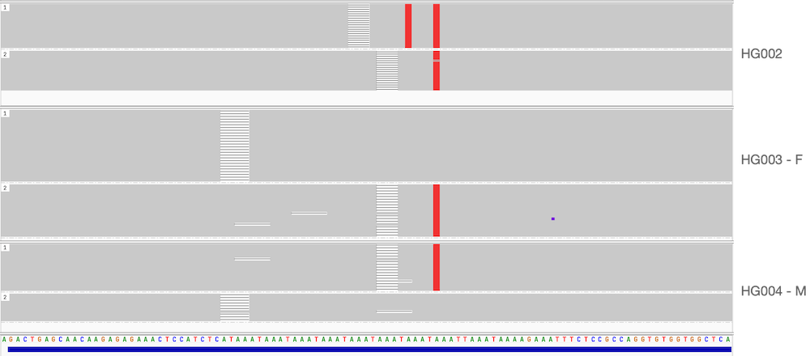

# Interpreting TRGT-denovo output

TRGT-denovo records all callable repeat sites into a tab-separated file. Sites that could not be called (often due to issues such as missing genotyping in one of the family members) are logged.

While it is simpler to report only a subset of the repeat definitions that actually show *de novo* signal, reporting all sites allows for more in-depth interpretation and quality control. Certain data characteristics can inflate the number of *de novo* candidates, which often turn out to be false positives. For example, when a sample, particularly from one of the parents, has significantly lower coverage than the other family members, this significantly increases the likelihood of allele dropout. In this context, allele dropout refers to scenarios where one of the alleles has minimal or no sequencing reads:


<p style="text-align: center;">
Low or absent coverage complicates the accurate identification of de novo mutations.
</p>

In cases of dropout, there's a risk of misinterpreting a heterozygous allele as homozygous, potentially leading to erroneous categorization of a child's allele as *de novo*. Therefore, reporting all sites in the repeat catalog provides insights into the distribution of potential *de novo* calls. For instance, analyzing the *de novo* coverage metric (the number of child reads differing from parental data), and its distribution offers useful insights:


<p style="text-align: center;">
Distributions of the TRGT-denovo de novo coverage metric in a matched and permuted trio.
</p>

The figure above shows the *de novo* coverage metric distributions in both matched and permuted trios. A very small number of *de novo* loci is expected. The *de novo* coverage is a useful measure in assessing confidence, factoring in local coverage. As seen in the permuted trio, a substantial number of putative *de novo* mutations are found, aligning with expectations. Each site with increased *de novo* coverage suggests significant deviation in the child's data from the parental, indicating a potential *de novo* mutation, or in the case of the permuted sample, a possible sample mix-up. In matched trios, this metric is equally useful, clearly demonstrating the impact of coverage imbalance:


<p style="text-align: center;">
Distributions of the TRGT-denovo de novo coverage metric in coverage balanced and imbalanced trios.
</p>

The distributions of the TRGT-denovo *de novo* coverage metric in coverage-balanced and imbalanced trios highlight an important point: as coverage decreases, the probability of insufficient allele coverage increases, leading to an increase in false positive *de novo* calls. These distributions are helpful in establishing thresholds to filter out false positives and refine the list of candidate mutations.

## HG002 example

Below TRGT-denovo output of HG002 is shown for two candidate *de novo* tandem repeat mutation sites:
```
trid	genotype	denovo_coverage	allele_coverage	allele_ratio	child_coverage	child_ratio	mean_diff_father	mean_diff_mother	father_dropout_prob	mother_dropout_prob	allele_origin	denovo_status	per_allele_reads_father	per_allele_reads_mother	per_allele_reads_child	index	father_motif_counts	mother_motif_counts	child_motif_counts
chr1_47268728_47268830_ATAA	1	19	37	0.5135	37	0.5135	6.7368	6.7368	0.0000	0.0000	M:1	Y:=	43	26	37	0	25	25	25
chr1_7862944_7863157_TATTG	1	0	21	0.0000	37	0.0000	0.0000	19.2000	0.0000	0.0000	F:2	X	18,17	16,19	21,16	0	27,29	27,63	29,60
chr1_7862944_7863157_TATTG	2	16	16	1.0000	37	0.4324	171.8750	22.8750	0.0000	0.0000	M:2	Y:-	18,17	16,19	21,16	1	27,29	27,63	29,60
```

### Site 1

The first site is homozygous in the child, hence only one call is made:

```
chr1_47268728_47268830_ATAA	1	19	37	0.5135	37	0.5135	6.7368	6.7368	0.0000	0.0000	M:1	Y:=	43	26	37	0	25	25	25
```

It has a *de novo* coverage of 19, i.e., there are 19 reads that support a candidate *de novo* allele relative to the parental read alignments. The *de novo* coverage should always be put into context of the total coverage, to ascertain that:

1. There is sufficient coverage
2. The ratio between the two is close to 0.5

The *de novo* coverage at this site is high and the ratio makes it likely that this is a confident call. However, the score difference with respect to either parents is low, such that the expected event size is small. Additionally, the score difference is equivalent in both parents such that parental origin may not be assessed. Generally the parent with the smallest score difference is the one from which is inherited:


<p style="text-align: center;">
</p>

### Site 2

The second site is heterozygous in the child, hence both child alleles are tested:

```
chr1_7862944_7863157_TATTG	1	0	21	0.0000	37	0.0000	0.0000	19.2000	0.0000	0.0000	F:2	X	18,17	16,19	21,16	0	27,29	27,63	29,60
chr1_7862944_7863157_TATTG	2	16	16	1.0000	37	0.4324	171.8750	22.8750	0.0000	0.0000	M:2	Y:-	18,17	16,19	21,16	1	27,29	27,63	29,60
```

The second allele is a potential *de novo* call (note that the long allele in TRGT is always the second allele). The score difference with respect to the maternal alleles is the smallest.


<p style="text-align: center;">
</p>
